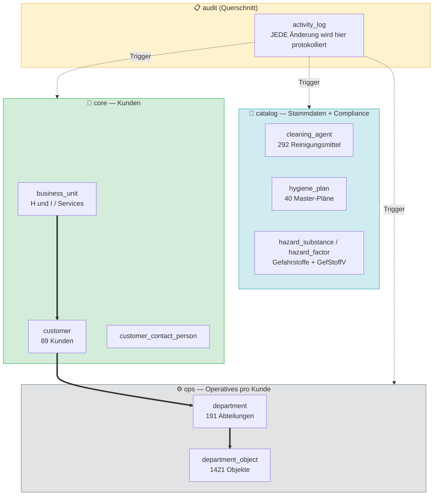
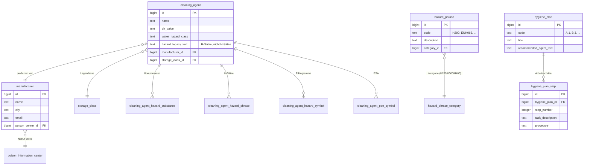
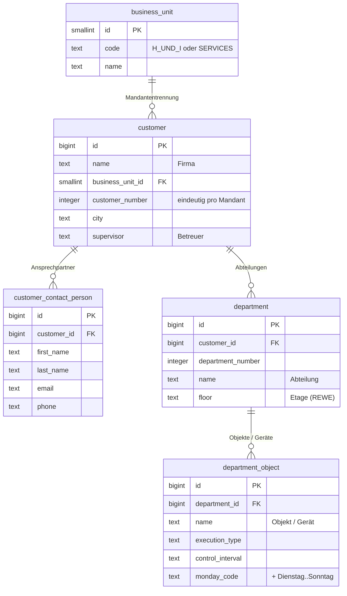
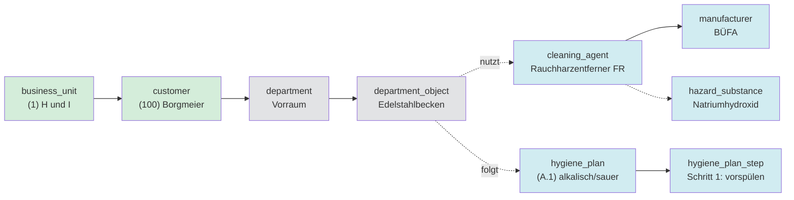
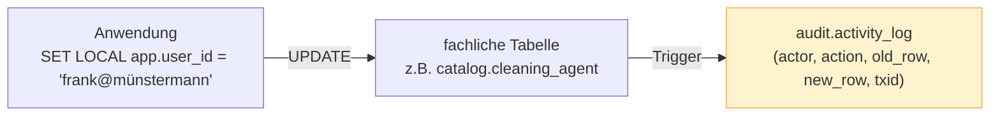

# Architektur — Münstermann Migration

Übersicht über die PostgreSQL-Zielstruktur. Alle Diagramme sind in
[Mermaid](https://mermaid.js.org/) — werden direkt in GitHub, GitLab, VS Code
und vielen anderen Markdown-Renderern angezeigt. Wer kein Mermaid hat,
findet weiter unten ASCII-Fallbacks.

---

## 1. Schema-Übersicht — die vier Domänen



**Lese-Richtung:** `catalog` enthält Stammdaten (was es gibt), `core` enthält Kunden
(wer es bekommt), `ops` enthält operative Daten (was bei welchem Kunden gemacht wird).
`audit` ist ein Querschnitts-Schema, das jede Änderung in den drei anderen mitschreibt.

---

## 2. Detail — Catalog-Domäne

Die Reinigungsmittel-Welt. Hier liegt der **Compliance-Kern** (GefStoffV / REACH / CLP).



**Junction-Tabellen** (n:m-Beziehungen, aus Access "Gefahrstoffe 1-5" etc. aufgelöst):
`cleaning_agent_hazard_substance`, `cleaning_agent_hazard_phrase`, `cleaning_agent_hazard_symbol`, `cleaning_agent_ppe_symbol`.

Daneben (nicht im Diagramm, weil keine FKs zu cleaning_agent): `hazard_substance`
(Master-Gefahrstoffliste), `hazard_factor` (GefStoffV-Faktoren-Katalog).

---

## 3. Detail — Core + Ops (Kunden-Welt)



---

## 4. Vertikaler Datenfluss — Wie laufen die Tabellen zusammen?

Beispiel: ein Reinigungseinsatz beim Kunden Borgmeier in der Abteilung
"Vorraum" mit dem Mittel "Rauchharzentferner FR":



Die gepunkteten Verbindungen `obj -. nutzt .-> ca` und `obj -. folgt .-> plan` sind
**noch nicht modelliert** — sie kommen in der nächsten Etappe als
`ops.department_object_cleaning_agent` und `ops.customer_hygiene_plan`.

---

## 5. Audit-Trail (audit-Schema)

Jede `INSERT`/`UPDATE`/`DELETE` auf einer fachlichen Tabelle wird durch einen
Trigger nach `audit.activity_log` geschrieben:



Das gibt uns rechtssichere Nachvollziehbarkeit (HACCP, GefStoffV, IFS-Audit-Anforderung).

---

## ASCII-Fallback (für Renderer ohne Mermaid)

```
   ┌───────────────────────────────────────────────────────────────┐
   │ audit.activity_log    ←──  Trigger auf jeder fachlichen Tabelle│
   └───────────────────────────────────────────────────────────────┘
                                ↑          ↑          ↑
                                │          │          │
   ╔═══════════════════════════╗  ╔═══════════════╗  ╔══════════════════╗
   ║ catalog (Stammdaten)      ║  ║ core (Kunden) ║  ║ ops (operativ)   ║
   ║                           ║  ║               ║  ║                  ║
   ║  hazard_phrase_category   ║  ║ business_unit ║  ║ department       ║
   ║     ↓                     ║  ║      ↓        ║  ║      ↓           ║
   ║  hazard_phrase            ║  ║ customer ────────→ department_object║
   ║                           ║  ║      ↓        ║  ║                  ║
   ║  poison_information_center║  ║ contact_person║  ╚══════════════════╝
   ║     ↓                     ║  ║               ║          ↑
   ║  manufacturer             ║  ║ country       ║          │
   ║     ↓                     ║  ║ microbio_lab  ║          │
   ║  cleaning_agent ──────────╬──╬───────────────╬──────────┘
   ║   ↓ (n:m Junctions)       ║  ║               ║
   ║  hazard_substance         ║  ╚═══════════════╝
   ║  hazard_phrase            ║
   ║  hazard_symbol            ║
   ║  ppe_symbol               ║
   ║                           ║
   ║  storage_class            ║
   ║                           ║
   ║  hygiene_plan             ║
   ║     ↓                     ║
   ║  hygiene_plan_step        ║
   ║                           ║
   ║  hazard_factor (GefStoffV)║
   ╚═══════════════════════════╝
```

---

## Wie schaue ich die Mermaid-Diagramme an?

- **GitHub-Web-Oberfläche**: rendert das `.md` direkt — diese Datei einfach im Repo öffnen.
- **VS Code**: Markdown-Vorschau (`Cmd+Shift+V`) + Extension "Markdown Preview Mermaid Support".
- **Online**: Code aus den Diagrammen kopieren und in [mermaid.live](https://mermaid.live) einfügen.
- **In der Konsole**: ASCII-Fallback unten reicht.
